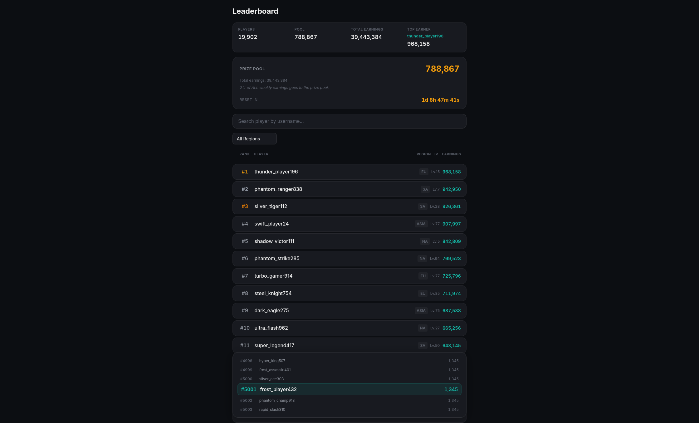
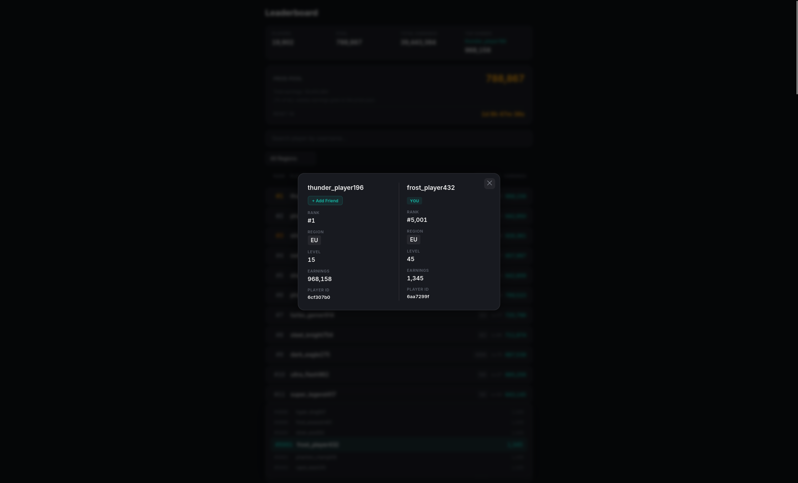

# Game Leaderboard

A real-time weekly leaderboard system for mobile games, tracking player earnings, rankings, and prize pools with live updates.

**Purpose** — Provide competitive visibility into player performance across global and regional leaderboards, resetting weekly with fresh prize pools. Designed for scale: 10,000+ players, sub-millisecond rank lookups, and real-time score updates.

**Tech Stack**
- **Backend** — NestJS (TypeScript) with modular architecture
- **Frontend** — React 18 + Vite, TypeScript, CSS Modules
- **Live Rankings** — Redis (sorted sets for O(log N) rank queries)
- **Primary DB** — PostgreSQL (players, earnings, pools, payouts)
- **Archive** — MongoDB (weekly snapshots for historical analysis)
- **Infrastructure** — Docker Compose (multi-container orchestration)

**Key Functions**
- Live leaderboard with weekly reset, pagination (100 per page), and region filtering (NA/EU/ASIA/SA/OC)
- Player search by username with profile details (rank, region, level, earnings)
- Global statistics: total players, prize pool amount, top earner, region breakdown
- Sticky rank bar showing current user with 3 above + 2 below
- Prize pool countdown and earnings event recording via REST API
- Seed scripts generate 10,000 players with realistic weighted distributions

## Screenshots



## Quick Start

```bash
docker compose up -d
docker compose exec -T backend node dist/src/migrations/run.js
docker compose exec -T backend node dist/src/scripts/seed-players.js
docker compose exec -T backend node dist/src/scripts/seed-earnings.js
```

Then open **http://localhost:3000**.

## Architecture

```
frontend (React/Vite, nginx)
  │  /api/* → proxied to backend
  ▼
backend (NestJS)
  ├─ Redis    — live sorted-set leaderboard, pool totals
  ├─ PostgreSQL — players, weekly_earnings, weekly_pools, payouts
  └─ MongoDB — weekly snapshots (archive)
```

## Features

- **Live leaderboard** — rank, earnings, prize pool with weekly reset
- **Region filter** — filter by NA / EU / ASIA / SA / OC
- **Global stats** — total players, pool amount, top earner, region breakdown
- **Player search** — find any player by username, click to view profile
- **Player detail** — click any row to see rank, region, level, earnings
- **Sticky rank bar** — shows current user with 3 above + 2 below (vertical layout)
- **Pagination** — 100 per page with prev/next navigation
- **Dark gaming theme** — optimized for readability, amber/gold highlights

## Seed Data

The seed scripts create 10,000 players with weighted earnings distributions:

| Percentile | Earnings Range    |
|------------|-------------------|
| top 0.1%   | 100,000 – 999,999 |
| top 1%     | 10,000 – 99,999   |
| top 10%    | 1,000 – 9,999     |
| rest       | 100 – 999         |

Regions are weighted: NA 35%, EU 30%, ASIA 20%, SA 10%, OC 5%. Player levels range from 1–100 with mid-level bias.

## API Endpoints

| Method | Path | Description |
|--------|------|-------------|
| GET | `/api/leaderboard/top` | Top players (`?region=EU&offset=0&limit=100`) |
| GET | `/api/leaderboard/player/:id` | Player rank + neighbours |
| GET | `/api/leaderboard/player/:id/profile` | Player profile |
| GET | `/api/leaderboard/search` | Search by username (`?q=foo`) |
| GET | `/api/leaderboard/stats` | Global statistics |
| GET | `/api/leaderboard/pool` | Prize pool info |
| GET | `/api/leaderboard/countdown` | Weekly reset countdown |
| POST | `/api/leaderboard/earnings` | Record an earning event |

## Project Structure

```
backend/
├── src/
│   ├── leaderboard/
│   │   ├── dto/           — API response types
│   │   ├── services/      — ranking, prize logic
│   │   └── leaderboard.controller.ts
│   ├── providers/         — Redis, PostgreSQL, MongoDB adapters
│   ├── migrations/        — SQL schema migrations
│   └── scripts/           — seed scripts (compiled to dist/)
├── docker-compose.yml
└── Dockerfile

frontend/
├── src/
│   ├── api/               — API client functions
│   ├── components/        — React components
│   └── App.tsx
└── Dockerfile
```

## Development

```bash
# Start infrastructure
docker compose up -d postgres redis mongodb

# Backend (http://localhost:3001)
cd backend
cp .env .env.local   # edit if needed
npm install
npm run start:dev

# Frontend (http://localhost:5173)
cd frontend
npm install
npm run dev
```


## How AI Was Used

I used several AI-assisted development tools throughout the project:

- **OpenCode** for architecture analysis, planning and the majority of the implementation.
- **Antigravity** (gemini flash) for general guidance, documentation and technical research.
- **Copilot.vim** for inline code completion and autocomplete while manually editing the codebase when needed.

### Research and Architecture

- Researched existing leaderboard implementations and identified several relevant open-source projects.
  - github.com/search?q=panteon&type=repositories&s=updated&o=desc&p=1
  - github.com/search?q=leaderboard+language%3ATypeScript&type=repositories&l=TypeScript
- Cloned some of these repositories and used OpenCode to analyze their architecture, technology stack decisions, and code organization.
- Studied system design resources including:
  - https://systemdesign.one/leaderboard-system-design/
  and got feedback and suggestions from couple of models feeding case requirements, my decisions, mistakes noticed in existing solutions and this article.
- Used these references to decide on the high-level architecture, steps for spec driven dev., technology stack and to implementation guidelines for AI agents.

### Planning and Design

- Sketched the initial UI/UX (on white board) 
- Generated project documentation outlining:
  - Required features
  - TODOs
  - Development rules and constraints
- Used the **ui-ux-pro-max-skill** Claude Skill to refine the UI/UX design:
  - https://skillsmp.com/creators/nextlevelbuilder/ui-ux-pro-max-skill/claude-skills-ui-ux-pro-max

### Development

- Used AI primarily as an engineering assistant for planning, code generation, code review, and documentation.
- All generated code was reviewed and modified as needed during the process.

